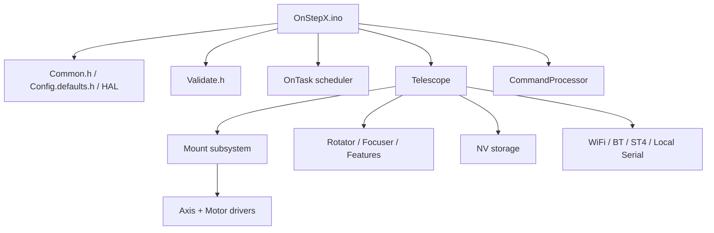
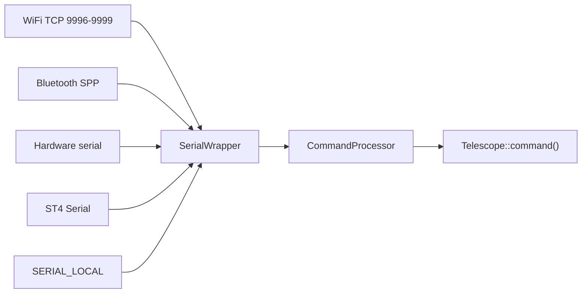
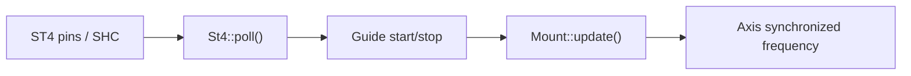

# OnStepX 펌웨어 아키텍처 문서

작성 기준: 2026-06-29 현재 작업트리의 OnStepX 소스, `Config.h`, `platformio.ini` 설정. 최근 성능 점검 변경(`REFRACTION_DUAL`, 웹 태스크 yield, Auxiliary poll rate 조정, TMC driver status OFF)을 포함한다.

English version: `architecture_en.md`

이 문서는 OnStepX 펌웨어가 어떻게 초기화되고, 어떤 계층으로 나뉘며, 통신 명령이 실제 모션 제어까지 어떻게 전달되는지 설명한다.

## 전체 구조

OnStepX는 Arduino sketch 형식을 유지하지만 실제 구현은 `src/` 아래 C++ 모듈로 나뉜다.

## 현재 하드웨어/기능 구성

현재 `Config.h` 기준 주요 구성은 다음과 같다.

| 영역 | 설정 |
| --- | --- |
| MCU/보드 | ESP32 Dev Module compatible, `MF_OOZOO_E4` pinmap |
| 마운트 | `ALTAZM_UNL`, `TOPOCENTRIC`, `REFRACTION_DUAL` tracking compensation |
| Axis1/Axis2 | `TMC2209`, 64000 steps/degree, tracking 256 microsteps, goto 16 microsteps, driver status `OFF` |
| Axis3 | `OFF`, rotator 비활성 |
| Axis4~Axis9 | `OFF`, local focuser 축 비활성 |
| WiFi | `SERIAL_RADIO WIFI_ACCESS_POINT` |
| Web server | `WEB_SERVER ON`, `website` plugin 활성 |
| ST4 | `ST4_INTERFACE ON`, `ST4_HAND_CONTROL ON` |
| Weather/temperature | `BME280_0x76`, internal temperature display 활성 |
| Auxiliary features | Feature1/2 dew heater 활성, 현재 Auxiliary poll 100ms |
| PlatformIO env | `onstepx_esp32_mf_oozoo_e4` |

## 빌드 구성 계층

### `Config.h`

사용자 설정 파일이다. 핀맵, 통신 모드, 마운트 타입, 축 드라이버, ST4, 기능 핀 등을 지정한다.

### `src/Config.defaults.h`

사용자가 생략한 값을 기본값으로 채우고, 상위 설정을 하위 매크로로 변환한다.

예:

- `SERIAL_RADIO WIFI_ACCESS_POINT`
- `SERIAL_IP_MODE WIFI_ACCESS_POINT`
- `WEB_SERVER ON`
- `OPERATIONAL_MODE WIFI`
- `AP_ENABLED true`

### `src/Common.h`

대부분의 모듈이 공통으로 포함하는 중심 헤더다.

주요 역할:

- Arduino, constants, config, defaults 포함
- HAL 및 pinmap 포함
- 기능 존재 여부 매크로 생성
- `MOUNT_PRESENT`, `ROTATOR_PRESENT`, `FOCUSER_PRESENT`, `FEATURES_PRESENT` 결정
- local command channel, standard IP serial, persistent IP serial 강제 활성화
- `ST4_HAND_CONTROL ON`일 때 `SERIAL_ST4_MASTER ON` 설정

### `src/Validate.h`

설정값의 범위와 조합을 컴파일 타임에 점검한다. 빌드가 되더라도 런타임 품질까지 보장하는 것은 아니며, 특히 통신/무선 동시 사용은 실제 테스트가 필요하다.

## 부팅 순서

부팅은 `OnStepX.ino::setup()`에서 시작한다.

1. Add-on select pin 초기화
2. Debug serial 시작
3. pinmap별 `PIN_INIT()` 실행
4. 펌웨어 버전, MCU, pinmap 로그 출력
5. `HAL_INIT()` 및 `WIRE_INIT()`
6. `analog.begin()`
7. NV gate 설정 및 NV 초기화
8. 입력 sense polling 태스크 시작
9. `telescope.init()`
10. `commandChannelInit()`
11. `tasks.yield(2000)`으로 초기 command/transport settling
12. 플러그인 초기화
13. profiler 태스크 시작(`DEBUG == PROFILER`일 때)
14. `sense.poll()`
15. `telescope.ready = true`

`loop()`는 별도 로직 없이 `tasks.yield()`만 호출한다. 따라서 주기 동작은 모두 OnTask 태스크로 관리된다.

## 태스크 모델

OnStepX는 `src/lib/tasks/OnTask.*`의 cooperative scheduler를 중심으로 동작한다. ESP32에서 웹 서버는 별도 FreeRTOS 태스크로 분리되고, step pulse 출력은 Step/Dir motor 계층의 hardware timer가 담당한다.

대표 태스크:

| 태스크 | 생성 위치 | 현재 주기/우선순위 | 역할 |
| --- | --- | --- | --- |
| `Motor_1/2` | `StepDir.cpp` | hardware timer, priority 0 | Axis1/2 step pulse 생성 |
| `Ax1Motn/Ax2Motn` | `Axis.cpp` | `HAL_FRACTIONAL_SEC_US`, priority 1 | 축 위치/속도 update |
| `MntGoto` | `Goto.cpp` | `HAL_FRACTIONAL_SEC_US`, priority 3 | goto stage/refinement |
| `MtGuide` | `Guide.cpp` | `HAL_FRACTIONAL_SEC_US / 2`, priority 3 | guide 상태와 pulse guide update |
| `MtTrack` | `Mount.cpp` | 1000ms, priority 6 | tracking rate/상태 update |
| `MtLimit` | `Limits.cpp` | 100ms, priority 2 | motion limit 검사 |
| `SysSens` | `OnStepX.ino` | 약 5ms, priority 7 | 입력 sense polling |
| `SysCmd*` | `ProcessCmds.cpp` | 2500us, priority 5 | 외부 명령 채널 polling |
| `SysCmdL` | `ProcessCmds.cpp` | 3ms, priority 5 | local command channel |
| `CmdBrkr` | `CommandBroker.cpp` | 3ms, priority 5 | 내부 명령 큐 처리 |
| `St4Mntr` | `St4.cpp` | 약 10ms, priority 2 | ST4 버튼/tone 감지 |
| `St4Comm` | `St4.cpp` | 100us minimum, priority 1 | SHC 직렬 링크 |
| `AuxPoll` | `Features.cpp` | `FEATURES_POLL_RATE_MS`, priority 6 | Auxiliary feature polling |
| `WeaPoll` | `Weather.cpp` | 1000ms, priority 7 | BME280/weather polling |
| `SysTemp` | `Telescope.cpp` | 500ms, priority 6 | MCU temperature polling |
| `StaLed` | `Telescope.cpp` | 500ms, priority 4 | 상태 LED/error flash |
| `WifiChk` | `WifiManager.cpp` | 8000ms | Station reconnect |
| `WebSvrTask` | `Website.cpp` | FreeRTOS core 0, priority 1 | HTTP 요청과 web state polling |

현재 ESP32 HAL의 `HAL_FRACTIONAL_SEC`는 약 105.26Hz이므로 Axis/Goto 계층의 motion update는 약 9.5ms 단위다. 실제 step pulse timing은 이보다 아래 계층인 hardware timer에서 만들어지며, 상위 태스크는 목표 rate와 상태를 갱신한다.

## Telescope 계층

`Telescope`는 펌웨어의 루트 애플리케이션 객체다.

주요 책임:

- 펌웨어 버전/빌드 시간 저장
- NV volume과 KV partition 초기화
- GPIO, CAN, weather, temperature 초기화
- WiFi manager 시작
- Mount, Rotator, Focuser, Features 초기화 및 begin 호출
- 공통 명령 처리
- 명령을 하위 시스템으로 분배

`Telescope::command()`는 명령 라우터 역할을 한다. 플러그인, mount, guide, goto, park, site, limits, home, pec, axis, rotator, focuser, features 순으로 명령을 전달한다.

## 통신 계층

통신 계층은 물리 transport와 명령 처리를 분리한다.

### `SerialWrapper`

`SerialWrapper`는 컴파일된 채널을 순서대로 하나씩 할당하고, `begin/read/write/available`을 공통 Stream 인터페이스로 제공한다.

지원 가능한 채널:

- `SERIAL_A`~`SERIAL_D`
- `SERIAL_ST4`
- `SERIAL_BT`
- `SERIAL_PIP1`~`SERIAL_PIP3`
- `SERIAL_SIP`
- `SERIAL_LOCAL`

현재 작업트리에서는 `Common.h`가 local command channel, standard IP serial channel, persistent IP serial channel을 활성화한다. WiFi AP 모드에서는 TCP command stream과 web server가 함께 동작한다.

TMC2209 UART는 command transport가 아니라 motor driver 제어/설정 버스다. 현재 하드웨어는 1-wire UART 구성에서 RX readback을 사용하지 않는 전제로 잡혀 있으므로, `SERIAL_TMC_RX_DISABLE true`와 함께 Axis1/Axis2 `DRIVER_STATUS OFF`가 유지된다. `DRIVER_STATUS`를 켜면 TMC 상태 레지스터 readback이 필요해지고, RX가 연결되지 않았거나 1-wire readback이 불안정한 환경에서는 CRC error 또는 불필요한 polling 부하가 생길 수 있다.

### `CommandProcessor`

각 command channel마다 `CommandProcessor` 인스턴스가 생긴다. `poll()`은 다음 순서로 동작한다.

1. 아직 시작하지 않은 채널이면 `SerialPort.begin()` 호출
2. 수신 가능한 바이트를 `Buffer`에 추가
3. `#`을 만나거나 timeout이 지나면 명령 준비 여부 확인
4. `command()`로 명령 처리
5. 숫자 응답 또는 문자열 응답 생성
6. 체크섬 응답이 필요한 경우 체크섬과 시퀀스 추가
7. 원래 채널로 응답 전송

## Mount 계층

`Mount`는 Axis1/Axis2와 좌표 변환, tracking, startup authority, motion safety의 중심이다.

초기화 흐름:

1. `startupAuthority.init()`
2. `MOUNT_SETTINGS`를 NV에서 로드
3. Axis1/Axis2 초기화 및 motor 연결
4. `Mount::begin()`에서 driver calibration과 enable 상태 설정
5. Site 초기화
6. Transform 초기화
7. Home reset으로 좌표 기준 설정
8. Limits, Guide, Goto, Library, Park, PEC, ST4 초기화
9. Tracking off 상태로 시작
10. 좌표 memory/align model 복원
11. `MtTrack` 태스크 시작
12. autostart 처리

`Mount::update()`는 tracking rate, guide rate, PEC rate를 합산해 Axis1/Axis2의 synchronized frequency를 갱신한다. Goto 또는 고속 guide 상태에서는 상태 LED를 slew 상태로 전환하고 `xBusy`를 갱신한다.

현재 설정은 `TRACK_COMPENSATION_DEFAULT REFRACTION_DUAL`, `TRACK_COMPENSATION_MEMORY OFF`다. 부팅 시 tracking compensation은 항상 설정 파일의 기본값으로 시작하고, 대기 굴절 보정을 양축에 반영한다. `ALTAZM_UNL`/topocentric 구성에서는 장시간 tracking 정확도를 위해 이 설정이 핵심 보정 계층이다.

## Axis와 Motor 계층

`Axis`는 축 단위의 공통 모션 제어 객체다. 축의 단위는 용도에 따라 radians, degrees, microns 등이 될 수 있다.

주요 책임:

- motor 객체 연결
- steps-per-measure와 limit 관리
- 현재 motor/index/instrument coordinate 관리
- backlash 처리
- home/min/max sense 처리
- `autoGoto`, `autoSlew`, `autoSlewHome`
- motor driver parameter 관리

Motor 계층은 실제 driver 모델별 구현을 가진다.

대표 driver family:

- Step/Dir generic
- TMC stepper drivers
- Servo drivers
- ODrive
- KTech
- MKS Servo

현재 설정에서는 Axis1/Axis2가 TMC2209 stepper driver를 사용한다.

현재 Axis1/Axis2의 주요 모션 설정:

| 항목 | 값 |
| --- | --- |
| Steps per degree | 64000 |
| Tracking microsteps | 256 |
| Goto microsteps | 16 |
| Tracking 1 microstep | 약 0.05625 arcsec |
| Goto 1 microstep | 약 0.9 arcsec |
| Goto max rate | 5 deg/sec 기준 약 20k step/sec |
| ESP32 Step/Dir lower period limit | `HAL_MAXRATE_LOWER_LIMIT 40us` 기준 약 25k step/sec급, pulse mode 보정 포함 시 더 높은 영역까지 허용 |

정밀도 관점에서는 tracking microstep 256 설정이 이미 매우 촘촘하다. 개선 여지는 단순 microstep 증가보다 tracking compensation, backlash, guide/refinement, 기계적 유격, 전류/decay tuning, 실제 sidereal drift 측정 쪽에서 더 크다. Driver 상태 readback은 진단에는 유용하지만 현재 1-wire/RX OFF 하드웨어에서는 안정성 우선으로 비활성화한다.

## 좌표와 Goto

좌표 변환은 `src/telescope/mount/coordinates/Transform.*` 계층이 담당한다.

`Goto`는 target 좌표를 받아 다음을 수행한다.

- 현재 상태에서 goto 가능 여부 확인
- mount type과 pier side 판단
- waypoint 필요 여부 판단
- target까지 axis destination 계산
- 자동 slew 시작
- near-destination refinement
- abort/home/park goto 상태 처리

`GotoState`는 크게 `GS_NONE`, `GS_GOTO`로 나뉘고, 세부 단계는 `GotoStage`로 관리한다.

## Guide와 ST4

`Guide`는 수동 이동, pulse guide, spiral guide, home guide를 관리한다.

주요 enum:

- `GuideState`: `GU_NONE`, `GU_PULSE_GUIDE`, `GU_GUIDE`, `GU_SPIRAL_GUIDE`, `GU_HOME_GUIDE`, `GU_HOME_GUIDE_ABORT`
- `GuideRateSelect`: `GR_QUARTER`, `GR_HALF`, `GR_1X`, `GR_2X`, `GR_4X`, `GR_8X`, `GR_20X`, `GR_48X`, `GR_HALF_MAX`, `GR_MAX`, `GR_CUSTOM`
- `GuideAction`: `GA_NONE`, `GA_BREAK`, `GA_FORWARD`, `GA_REVERSE`, `GA_SPIRAL`, `GA_HOME`

ST4는 Guide 계층의 입력 장치로 동작한다.

현재 작업트리에서는 `ST4_SHC_TONE_LOSS_MS` 기본값 1500ms를 사용한다. SHC 활성 후 tone loss가 이 시간 이상 지속될 때만 ST4 serial을 해제하므로, 짧은 tone 누락으로 인한 SHC 재접속 증상을 줄인다.

## NV 저장 구조

NV 계층은 `src/lib/nv/` 아래에 있으며, `Telescope::init()`에서 volume을 mount하거나 format한다.

주요 partition:

| 파티션 | 용도 |
| --- | --- |
| `KV` | 설정값 저장 |
| `PEC` | PEC 데이터 |
| `LIBRARY` | 사용자 object/library 저장 |

대표 KV key:

- `MOUNT_SETTINGS`
- `WIFI_SETTINGS`
- `WIFI_STATIONn`
- `WIFI_STATIONn_PWD`
- `TELESCOPE_SETTINGS`
- 축/driver별 parameter key

`xBusy`는 timing-sensitive operation 중 I2C 등 일부 작업을 조심하기 위한 전역 gate로 사용된다.

## WiFi/Web 계층

현재 설정에서는 `OPERATIONAL_MODE WIFI`와 `WEB_SERVER ON`이 활성화된다.

`WifiManager`는 다음을 담당한다.

- AP/STA 설정 읽기
- SoftAP 또는 Station 시작
- mDNS 시작
- Station reconnect task 등록
- NV 기반 WiFi 설정 저장/복원

명령용 TCP stream은 `Serial_IP_Wifi.cpp`의 `IPSerial`이 담당한다. Web server 객체는 `src/lib/wifi/webServer/WebServer.cpp`에서 포트 80으로 생성된다.

`website` 플러그인은 `src/plugins/website/Website.cpp`에서 route를 등록하고, `WebSvrTask` FreeRTOS 태스크를 core 0, priority 1로 시작한다. 루프는 `www.handleClient()`와 `state.poll()`을 호출한 뒤 `delay(1)`로 yield한다. 이 yield는 HTTP polling이 core를 계속 점유하는 상황을 줄이기 위한 현재 성능 개선점이다.

## Rotator, Focuser, Features

이 세 계층은 compile-time feature gating에 따라 활성화된다.

- Axis3 driver가 있으면 local Rotator
- Axis4~Axis9 driver가 있으면 local Focuser
- Feature purpose가 설정되면 Auxiliary Features
- CAN remote 설정이 있으면 remote client/server 구조도 가능

현재 설정에서는 local rotator/focuser 축은 비활성이고, auxiliary feature로 dew heater 2개가 활성화되어 있다.

Auxiliary feature monitor는 `FEATURES_POLL_RATE_MS`를 사용한다. 현재 Feature1/2가 dew heater 용도이므로 poll rate는 100ms이며, momentary switch, cover switch, intervalometer처럼 빠른 반응이 필요한 feature가 포함되면 기본 20ms로 전환된다. Momentary switch 지속 시간은 ms 값을 poll tick으로 환산하므로 poll rate 변경 후에도 동작 시간이 유지된다.

## 플러그인 구조

플러그인은 `src/plugins/Plugins.config.h`에서 최대 8개까지 지정할 수 있다.

플러그인이 명령을 처리하려면:

- `PLUGINn`에 인스턴스 이름 지정
- 해당 header include
- `PLUGINn_COMMAND_PROCESSING ON`
- 플러그인 클래스에 `init()`와 `command()` 구현

명령 처리 플러그인은 core subsystem보다 먼저 호출된다. 따라서 기존 명령과 충돌하지 않도록 prefix를 신중히 정해야 한다.

현재 설정은 `PLUGIN1 website`, `PLUGIN1_COMMAND_PROCESSING OFF`다. 즉 웹 UI와 route는 활성화되어 있지만 telescope command dispatch에는 플러그인 명령을 추가하지 않는다.

## PlatformIO 통합 구조

이 작업트리는 Arduino sketch 구조를 유지하면서 PlatformIO로 빌드한다.

핵심 파일:

| 파일 | 역할 |
| --- | --- |
| `platformio.ini` | PlatformIO 환경, board, library, source filter |
| `tools/platformio_main.cpp` | `OnStepX.ino`를 PlatformIO 빌드에 연결 |
| `platformio_deps.cpp` | PlatformIO LDF가 ESP32 내장 라이브러리를 찾도록 보조 |
| `.vscode/tasks.json` | VS Code 빌드/업로드/모니터 태스크 |
| `platformio.md` | PlatformIO 사용법 |

현재 기본 환경은 `onstepx_esp32_mf_oozoo_e4`다.

`platformio.ini`의 현재 핵심 설정:

| 항목 | 값 |
| --- | --- |
| Platform | `platformio/espressif32@6.7.0` |
| Board/framework | `esp32dev`, Arduino |
| Partition | `huge_app.csv` |
| Upload/monitor | 921600 / 115200 baud |
| Source entry | `tools/platformio_main.cpp`, `platformio_deps.cpp`, `src/**` |
| Excluded source | `OnStepX.ino`, `src/lib/commands/commands.ino`, `src/telescope/mount/coordinates/coordinates.ino` |
| 주요 library | `teemuatlut/TMCStepper@^0.7.3`, Adafruit BME280/Unified Sensor/BusIO |

## 확장 시 권장 경로

### 새 통신 입력 추가

1. 가능한 경우 기존 OnStep 명령으로 변환한다.
2. 내부 명령은 `CommandBroker` 사용을 우선한다.
3. 실시간 수동 이동은 직접 `Guide` API를 호출하는 편이 더 명확하다.
4. 입력 끊김 timeout과 release stop을 반드시 둔다.
5. Goto 중 입력 정책을 명확히 정한다.

### Bluetooth 게임패드 추가

현재 Bluetooth SPP와는 별도 기능이다. 직접 지원하려면 HID host 라이브러리 또는 ESP-IDF HID host 계층을 추가해야 한다.

권장 아키텍처:

안전 정책:

- 연결 끊김 시 모든 guide stop
- 스틱 dead zone
- 최대 guide rate 제한
- Goto 중 버튼 동작 정의
- Park/standby 상태에서 motion 차단
- 긴 버튼 조합은 실수 방지를 위한 hold time 적용

### 새 명령 추가

1. 해당 subsystem의 `*.command.cpp`에 추가한다.
2. 명령이 여러 subsystem과 충돌하지 않는지 `Telescope::command()` 분배 순서를 확인한다.
3. 성공/실패는 `CommandError`로 표현한다.
4. 문자열 응답이면 `numericReply=false`를 설정한다.
5. 필요하면 `COMMAND_REFERENCE.md`도 업데이트한다.

## 빠른 코드 지도

| 보고 싶은 것 | 시작 파일 |
| --- | --- |
| 부팅 순서 | `OnStepX.ino` |
| 설정 확장 | `src/Config.defaults.h` |
| 컴파일 타임 검증 | `src/Validate.h` |
| 전체 초기화 | `src/telescope/Telescope.cpp` |
| 명령 분배 | `src/telescope/Telescope.command.cpp` |
| 명령 채널 | `src/libApp/commands/ProcessCmds.cpp` |
| 프레임 파서 | `src/lib/commands/BufferCmds.cpp` |
| WiFi TCP 명령 | `src/lib/serial/Serial_IP_Wifi.cpp` |
| Web UI/plugin | `src/plugins/website/Website.cpp` |
| ST4/SHC | `src/telescope/mount/st4/St4.cpp` |
| 마운트 | `src/telescope/mount/Mount.cpp` |
| 가이드 | `src/telescope/mount/guide/Guide.cpp` |
| Goto | `src/telescope/mount/goto/Goto.cpp` |
| 축 제어 | `src/lib/axis/Axis.cpp` |
| Step/Dir pulse | `src/lib/axis/motor/stepDir/StepDir.cpp` |
| TMC2209 driver | `src/lib/axis/motor/stepDir/tmc/tmcStepper/tmc2209/Tmc2209.cpp` |
| Auxiliary features | `src/telescope/auxiliary/local/Features.cpp`, `src/telescope/auxiliary/local/Features.h` |
| 모터 드라이버 전체 | `src/lib/axis/motor/` |
| PlatformIO | `platformio.ini`, `platformio.md` |
