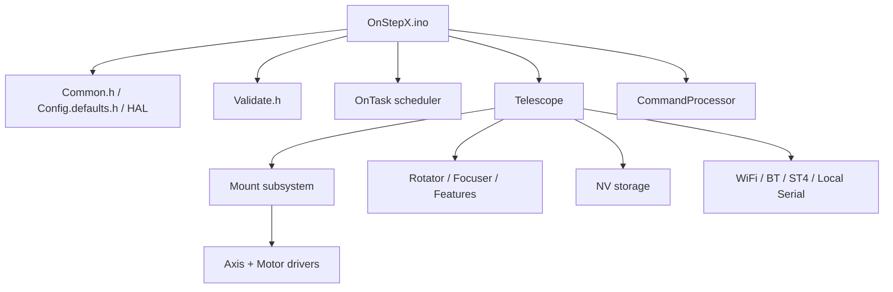
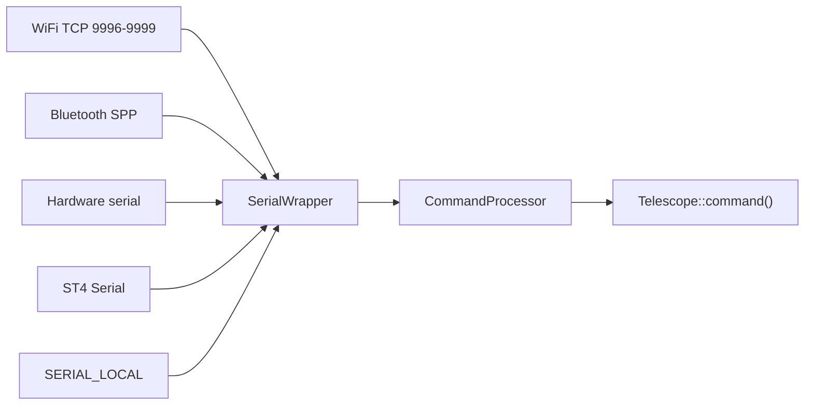
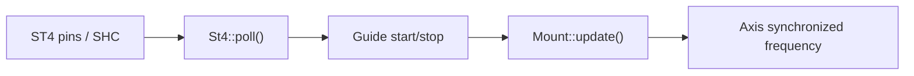
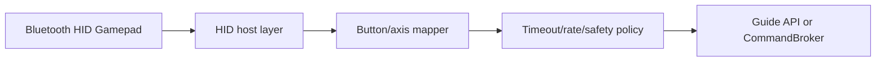

# OnStepX Firmware Architecture

Baseline: current working tree as of 2026-06-29, using the current `Config.h` and `platformio.ini`. This document includes the recent performance-review changes: `REFRACTION_DUAL`, web task yielding, Auxiliary poll-rate tuning, and TMC driver status left `OFF`.

Korean version: `architecture.md`

This document explains how the OnStepX firmware initializes, how the major layers are organized, and how communication commands flow down to motion control.

## Overall Structure

OnStepX keeps the Arduino sketch shape, but most implementation lives in C++ modules under `src/`.

## Current Hardware and Feature Configuration

The main configuration from the current `Config.h` is:

| Area | Setting |
| --- | --- |
| MCU/board | ESP32 Dev Module compatible, `MF_OOZOO_E4` pinmap |
| Mount | `ALTAZM_UNL`, `TOPOCENTRIC`, `REFRACTION_DUAL` tracking compensation |
| Axis1/Axis2 | `TMC2209`, 64000 steps/degree, tracking 256 microsteps, goto 16 microsteps, driver status `OFF` |
| Axis3 | `OFF`, local rotator disabled |
| Axis4-Axis9 | `OFF`, local focuser axes disabled |
| WiFi | `SERIAL_RADIO WIFI_ACCESS_POINT` |
| Web server | `WEB_SERVER ON`, `website` plugin enabled |
| ST4 | `ST4_INTERFACE ON`, `ST4_HAND_CONTROL ON` |
| Weather/temperature | `BME280_0x76`, internal temperature display enabled |
| Auxiliary features | Feature1/2 dew heaters enabled, current Auxiliary poll interval 100ms |
| PlatformIO env | `onstepx_esp32_mf_oozoo_e4` |

## Build Configuration Layers

### `Config.h`

This is the user configuration file. It selects the pinmap, communication modes, mount type, axis drivers, ST4, and feature pins.

### `src/Config.defaults.h`

This fills in defaults for values omitted by the user and expands higher-level settings into lower-level macros.

Examples:

- `SERIAL_RADIO WIFI_ACCESS_POINT`
- `SERIAL_IP_MODE WIFI_ACCESS_POINT`
- `WEB_SERVER ON`
- `OPERATIONAL_MODE WIFI`
- `AP_ENABLED true`

### `src/Common.h`

This is the central header included by most modules.

Main responsibilities:

- Include Arduino, constants, config, and defaults
- Include the HAL and pinmap
- Generate feature-presence macros
- Decide `MOUNT_PRESENT`, `ROTATOR_PRESENT`, `FOCUSER_PRESENT`, and `FEATURES_PRESENT`
- Force-enable the local command channel, standard IP serial, and persistent IP serial
- Set `SERIAL_ST4_MASTER ON` when `ST4_HAND_CONTROL ON`

### `src/Validate.h`

This checks configuration ranges and combinations at compile time. A successful build does not guarantee runtime quality; communication and wireless combinations still need real hardware testing.

## Boot Sequence

Boot starts in `OnStepX.ino::setup()`.

1. Initialize the add-on select pin
2. Start debug serial
3. Run the pinmap-specific `PIN_INIT()`
4. Log firmware version, MCU, and pinmap
5. Run `HAL_INIT()` and `WIRE_INIT()`
6. Call `analog.begin()`
7. Configure the NV gate and initialize NV storage
8. Start the input sense polling task
9. Run `telescope.init()`
10. Run `commandChannelInit()`
11. Call `tasks.yield(2000)` to let initial command/transport setup settle
12. Initialize plugins
13. Start the profiler task when `DEBUG == PROFILER`
14. Run `sense.poll()`
15. Set `telescope.ready = true`

`loop()` only calls `tasks.yield()`. Periodic work is therefore managed through OnTask tasks.

## Task Model

OnStepX is centered on the cooperative scheduler in `src/lib/tasks/OnTask.*`. On ESP32, the web server runs in a separate FreeRTOS task, and Step/Dir pulse output is handled by hardware timers in the motor layer.

Representative tasks:

| Task | Created in | Current period/priority | Role |
| --- | --- | --- | --- |
| `Motor_1/2` | `StepDir.cpp` | hardware timer, priority 0 | Generate Axis1/2 step pulses |
| `Ax1Motn/Ax2Motn` | `Axis.cpp` | `HAL_FRACTIONAL_SEC_US`, priority 1 | Update axis position/speed |
| `MntGoto` | `Goto.cpp` | `HAL_FRACTIONAL_SEC_US`, priority 3 | Goto stage/refinement |
| `MtGuide` | `Guide.cpp` | `HAL_FRACTIONAL_SEC_US / 2`, priority 3 | Guide state and pulse-guide updates |
| `MtTrack` | `Mount.cpp` | 1000ms, priority 6 | Tracking rate/status updates |
| `MtLimit` | `Limits.cpp` | 100ms, priority 2 | Motion limit checks |
| `SysSens` | `OnStepX.ino` | about 5ms, priority 7 | Input sense polling |
| `SysCmd*` | `ProcessCmds.cpp` | 2500us, priority 5 | External command-channel polling |
| `SysCmdL` | `ProcessCmds.cpp` | 3ms, priority 5 | Local command channel |
| `CmdBrkr` | `CommandBroker.cpp` | 3ms, priority 5 | Internal command queue processing |
| `St4Mntr` | `St4.cpp` | about 10ms, priority 2 | ST4 button/tone detection |
| `St4Comm` | `St4.cpp` | 100us minimum, priority 1 | SHC serial link |
| `AuxPoll` | `Features.cpp` | `FEATURES_POLL_RATE_MS`, priority 6 | Auxiliary feature polling |
| `WeaPoll` | `Weather.cpp` | 1000ms, priority 7 | BME280/weather polling |
| `SysTemp` | `Telescope.cpp` | 500ms, priority 6 | MCU temperature polling |
| `StaLed` | `Telescope.cpp` | 500ms, priority 4 | Status LED/error flash |
| `WifiChk` | `WifiManager.cpp` | 8000ms | Station reconnect |
| `WebSvrTask` | `Website.cpp` | FreeRTOS core 0, priority 1 | HTTP requests and web state polling |

The current ESP32 HAL uses `HAL_FRACTIONAL_SEC` of about 105.26Hz, so Axis/Goto motion updates run at about 9.5ms intervals. Actual step pulse timing is generated below that layer by hardware timers; higher-level tasks update target rates and state.

## Telescope Layer

`Telescope` is the firmware's root application object.

Main responsibilities:

- Store firmware version and build time
- Initialize the NV volume and KV partition
- Initialize GPIO, CAN, weather, and temperature subsystems
- Start the WiFi manager
- Initialize and begin Mount, Rotator, Focuser, and Features
- Handle common commands
- Dispatch commands to lower subsystems

`Telescope::command()` is the command router. It dispatches commands in this order: plugins, mount, guide, goto, park, site, limits, home, PEC, axis, rotator, focuser, and features.

## Communication Layer

The communication layer separates physical transports from command processing.

### `SerialWrapper`

`SerialWrapper` assigns compiled-in channels one by one and exposes a common Stream-like interface with `begin`, `read`, `write`, and `available`.

Supported channel families:

- `SERIAL_A`-`SERIAL_D`
- `SERIAL_ST4`
- `SERIAL_BT`
- `SERIAL_PIP1`-`SERIAL_PIP3`
- `SERIAL_SIP`
- `SERIAL_LOCAL`

In the current working tree, `Common.h` enables the local command channel, the standard IP serial channel, and persistent IP serial channels. In WiFi AP mode, TCP command streams and the web server run together.

The TMC2209 UART is not a command transport; it is the motor-driver control/configuration bus. The current hardware assumes 1-wire UART without RX readback, so `SERIAL_TMC_RX_DISABLE true` and Axis1/Axis2 `DRIVER_STATUS OFF` are intentional. Enabling `DRIVER_STATUS` requires TMC status-register readback; without reliable RX wiring/readback, it can cause CRC errors or unnecessary polling load.

### `CommandProcessor`

Each command channel gets a `CommandProcessor` instance. `poll()` works as follows:

1. If the channel has not started, call `SerialPort.begin()`
2. Append available received bytes to `Buffer`
3. When `#` is received or timeout expires, check whether a command is ready
4. Process the command through `command()`
5. Create a numeric or string reply
6. If a checksum reply is required, append checksum and sequence
7. Send the reply to the original channel

## Mount Layer

`Mount` is the center of Axis1/Axis2 control, coordinate transforms, tracking, startup authority, and motion safety.

Initialization flow:

1. `startupAuthority.init()`
2. Load `MOUNT_SETTINGS` from NV
3. Initialize Axis1/Axis2 and attach motors
4. Calibrate drivers and configure enable state in `Mount::begin()`
5. Initialize Site
6. Initialize Transform
7. Reset Home as the coordinate reference
8. Initialize Limits, Guide, Goto, Library, Park, PEC, and ST4
9. Start with tracking off
10. Restore coordinate memory/alignment model
11. Start the `MtTrack` task
12. Handle autostart

`Mount::update()` sums tracking, guide, and PEC rates, then updates the synchronized frequencies for Axis1/Axis2. During Goto or high-speed guide states it sets the status LED to slew state and updates `xBusy`.

The current configuration uses `TRACK_COMPENSATION_DEFAULT REFRACTION_DUAL` and `TRACK_COMPENSATION_MEMORY OFF`. Tracking compensation starts from the config default at every boot and applies atmospheric refraction compensation to both axes. With the `ALTAZM_UNL`/topocentric setup, this is a key layer for long-duration tracking accuracy.

## Axis and Motor Layers

`Axis` is the common per-axis motion-control object. Depending on use, the axis unit can be radians, degrees, microns, and so on.

Main responsibilities:

- Attach the motor object
- Manage steps-per-measure and limits
- Track current motor/index/instrument coordinates
- Handle backlash
- Handle home/min/max sensing
- Provide `autoGoto`, `autoSlew`, and `autoSlewHome`
- Manage motor-driver parameters

The Motor layer contains implementations for each driver model.

Representative driver families:

- Step/Dir generic
- TMC stepper drivers
- Servo drivers
- ODrive
- KTech
- MKS Servo

The current configuration uses TMC2209 stepper drivers for Axis1/Axis2.

Current Axis1/Axis2 motion settings:

| Item | Value |
| --- | --- |
| Steps per degree | 64000 |
| Tracking microsteps | 256 |
| Goto microsteps | 16 |
| Tracking 1 microstep | about 0.05625 arcsec |
| Goto 1 microstep | about 0.9 arcsec |
| Goto max rate | about 20k step/sec at 5 deg/sec |
| ESP32 Step/Dir lower period limit | about 25k step/sec class from `HAL_MAXRATE_LOWER_LIMIT 40us`; pulse-mode adjustment allows more headroom |

From a precision standpoint, tracking microstep 256 is already very fine. Better improvement opportunities are more likely in tracking compensation, backlash, guide/refinement behavior, mechanical play, current/decay tuning, and measured sidereal drift than in simply increasing microsteps. Driver readback is useful for diagnostics, but with the current 1-wire/RX-OFF hardware it is disabled for stability.

## Coordinates and Goto

Coordinate transforms are handled by `src/telescope/mount/coordinates/Transform.*`.

`Goto` receives a target coordinate and performs:

- Check whether goto is currently allowed
- Determine mount type and pier side
- Decide whether a waypoint is needed
- Calculate axis destinations for the target
- Start automatic slew
- Refine near the destination
- Handle abort/home/park goto states

`GotoState` is mainly divided into `GS_NONE` and `GS_GOTO`; detailed steps are managed by `GotoStage`.

## Guide and ST4

`Guide` manages manual motion, pulse guide, spiral guide, and home guide.

Main enums:

- `GuideState`: `GU_NONE`, `GU_PULSE_GUIDE`, `GU_GUIDE`, `GU_SPIRAL_GUIDE`, `GU_HOME_GUIDE`, `GU_HOME_GUIDE_ABORT`
- `GuideRateSelect`: `GR_QUARTER`, `GR_HALF`, `GR_1X`, `GR_2X`, `GR_4X`, `GR_8X`, `GR_20X`, `GR_48X`, `GR_HALF_MAX`, `GR_MAX`, `GR_CUSTOM`
- `GuideAction`: `GA_NONE`, `GA_BREAK`, `GA_FORWARD`, `GA_REVERSE`, `GA_SPIRAL`, `GA_HOME`

ST4 acts as an input device for the Guide layer.

The current working tree uses `ST4_SHC_TONE_LOSS_MS` default 1500ms. After SHC activation, ST4 serial is released only when tone loss lasts at least that long, reducing reconnect symptoms from short tone dropouts.

## NV Storage Structure

The NV layer is under `src/lib/nv/`, and `Telescope::init()` mounts or formats the volume.

Main partitions:

| Partition | Purpose |
| --- | --- |
| `KV` | Settings storage |
| `PEC` | PEC data |
| `LIBRARY` | User object/library storage |

Representative KV keys:

- `MOUNT_SETTINGS`
- `WIFI_SETTINGS`
- `WIFI_STATIONn`
- `WIFI_STATIONn_PWD`
- `TELESCOPE_SETTINGS`
- Axis/driver-specific parameter keys

`xBusy` is used as a global gate to avoid some operations, such as I2C activity, during timing-sensitive work.

## WiFi/Web Layer

The current configuration enables `OPERATIONAL_MODE WIFI` and `WEB_SERVER ON`.

`WifiManager` is responsible for:

- Reading AP/STA settings
- Starting SoftAP or Station mode
- Starting mDNS
- Registering the station reconnect task
- Saving/restoring WiFi settings through NV

Command TCP streams are handled by `IPSerial` in `Serial_IP_Wifi.cpp`. The web server object is created on port 80 in `src/lib/wifi/webServer/WebServer.cpp`.

The `website` plugin registers routes in `src/plugins/website/Website.cpp` and starts `WebSvrTask` as a FreeRTOS task on core 0, priority 1. Its loop calls `www.handleClient()` and `state.poll()`, then calls `delay(1)` to yield. That yield is the current performance improvement that prevents HTTP polling from continuously occupying the core.

## Rotator, Focuser, and Features

These layers are enabled through compile-time feature gating.

- A local Rotator exists when Axis3 has a driver
- Local Focusers exist when Axis4-Axis9 have drivers
- Auxiliary Features exist when feature purposes are configured
- CAN remote client/server structures are also possible when configured

The current configuration disables local rotator/focuser axes and enables two dew heaters as auxiliary features.

The Auxiliary feature monitor uses `FEATURES_POLL_RATE_MS`. With the current Feature1/2 dew-heater setup, the poll interval is 100ms. If a fast-response feature such as momentary switch, cover switch, or intervalometer is present, the default interval switches to 20ms. Momentary switch duration is converted from milliseconds into poll ticks, so the user-visible duration remains stable after poll-rate changes.

## Plugin Structure

Plugins are configured in `src/plugins/Plugins.config.h`, up to eight slots.

For a plugin to handle commands:

- Set `PLUGINn` to the instance name
- Include the plugin header
- Set `PLUGINn_COMMAND_PROCESSING ON`
- Implement `init()` and `command()` in the plugin class

Command-processing plugins are called before core subsystems. Choose prefixes carefully so they do not collide with existing commands.

The current configuration is `PLUGIN1 website`, `PLUGIN1_COMMAND_PROCESSING OFF`. The web UI and routes are enabled, but the plugin does not add telescope command-dispatch handling.

## PlatformIO Integration

This working tree keeps the Arduino sketch structure while building with PlatformIO.

Core files:

| File | Role |
| --- | --- |
| `platformio.ini` | PlatformIO environment, board, library, and source filter |
| `tools/platformio_main.cpp` | Connects `OnStepX.ino` to the PlatformIO build |
| `platformio_deps.cpp` | Helps PlatformIO LDF find ESP32 built-in libraries |
| `.vscode/tasks.json` | VS Code build/upload/monitor tasks |
| `platformio.md` | PlatformIO usage notes |

The current default environment is `onstepx_esp32_mf_oozoo_e4`.

Current key settings from `platformio.ini`:

| Item | Value |
| --- | --- |
| Platform | `platformio/espressif32@6.7.0` |
| Board/framework | `esp32dev`, Arduino |
| Partition | `huge_app.csv` |
| Upload/monitor | 921600 / 115200 baud |
| Source entry | `tools/platformio_main.cpp`, `platformio_deps.cpp`, `src/**` |
| Excluded source | `OnStepX.ino`, `src/lib/commands/commands.ino`, `src/telescope/mount/coordinates/coordinates.ino` |
| Main libraries | `teemuatlut/TMCStepper@^0.7.3`, Adafruit BME280/Unified Sensor/BusIO |

## Recommended Extension Paths

### Add a New Communication Input

1. Convert input to existing OnStep commands when possible.
2. Prefer `CommandBroker` for internal commands.
3. For real-time manual motion, direct `Guide` API calls are clearer.
4. Always include input-loss timeout and release-stop behavior.
5. Define the policy for input during Goto.

### Add a Bluetooth Gamepad

This is separate from the current Bluetooth SPP support. Direct gamepad support requires a HID host library or ESP-IDF HID host layer.

Recommended architecture:

Safety policy:

- Stop all guide motion on disconnect
- Apply a stick dead zone
- Limit maximum guide rate
- Define button behavior during Goto
- Block motion while parked or in standby
- Use hold time for long button combinations that should be hard to trigger accidentally

### Add a New Command

1. Add it to the appropriate subsystem `*.command.cpp`.
2. Check `Telescope::command()` dispatch order to avoid collisions with other subsystems.
3. Return success/failure through `CommandError`.
4. Set `numericReply=false` for string replies.
5. Update `COMMAND_REFERENCE.md` if needed.

## Quick Code Map

| What to inspect | Start file |
| --- | --- |
| Boot sequence | `OnStepX.ino` |
| Configuration expansion | `src/Config.defaults.h` |
| Compile-time validation | `src/Validate.h` |
| Full initialization | `src/telescope/Telescope.cpp` |
| Command dispatch | `src/telescope/Telescope.command.cpp` |
| Command channels | `src/libApp/commands/ProcessCmds.cpp` |
| Frame parser | `src/lib/commands/BufferCmds.cpp` |
| WiFi TCP commands | `src/lib/serial/Serial_IP_Wifi.cpp` |
| Web UI/plugin | `src/plugins/website/Website.cpp` |
| ST4/SHC | `src/telescope/mount/st4/St4.cpp` |
| Mount | `src/telescope/mount/Mount.cpp` |
| Guide | `src/telescope/mount/guide/Guide.cpp` |
| Goto | `src/telescope/mount/goto/Goto.cpp` |
| Axis control | `src/lib/axis/Axis.cpp` |
| Step/Dir pulse | `src/lib/axis/motor/stepDir/StepDir.cpp` |
| TMC2209 driver | `src/lib/axis/motor/stepDir/tmc/tmcStepper/tmc2209/Tmc2209.cpp` |
| Auxiliary features | `src/telescope/auxiliary/local/Features.cpp`, `src/telescope/auxiliary/local/Features.h` |
| All motor drivers | `src/lib/axis/motor/` |
| PlatformIO | `platformio.ini`, `platformio.md` |
